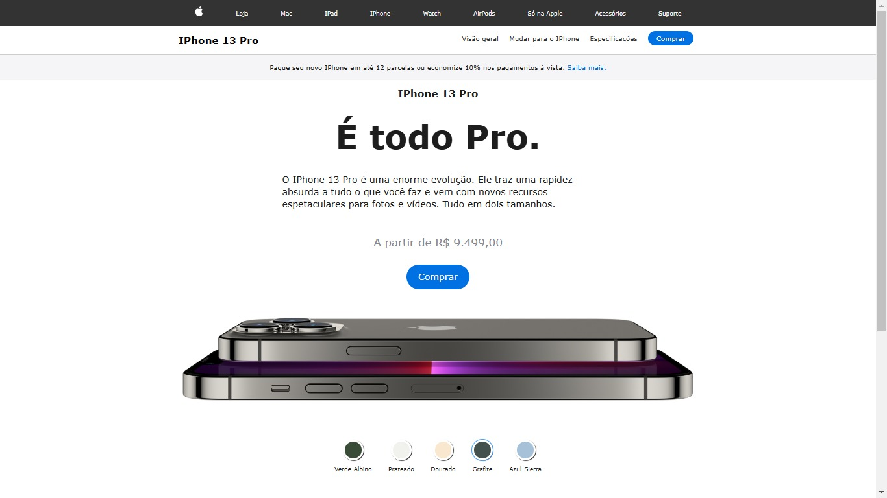

# Clone da página de vendas do IPhone 13, feito com HTML, CSS e JavaScript.

## Este projeto foi desenvolvido durante o excelente curso do Hora de Codar!

### Aqui o foco foi mais no topo da página, uma vez que meu intuito foi de reforçar os conceitos básicos da Stack utilizada.

> PrintScreen da tela exibindo o layout da página.
